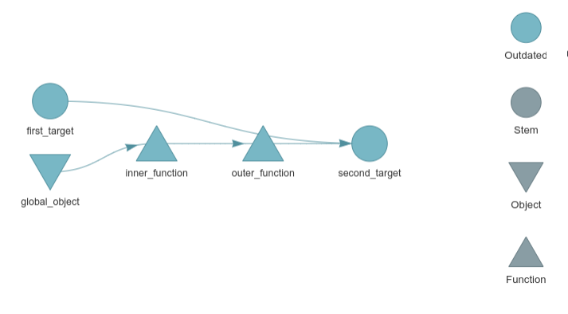
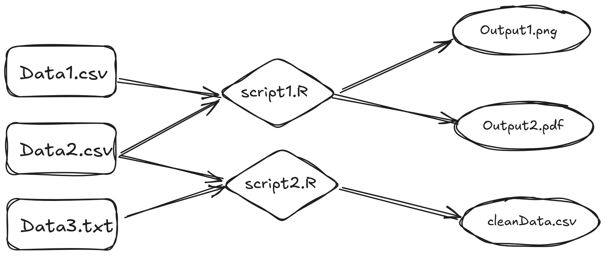

I sometimes work for a large projects. But it’s very hard to manage this project. So I wonder whether I can organize the data, processed data, results, scripts. I hope I can create a way like [target](https://books.ropensci.org/targets) package. 

However, `target` package is hard to use. I want to have a simple way to record and output.

